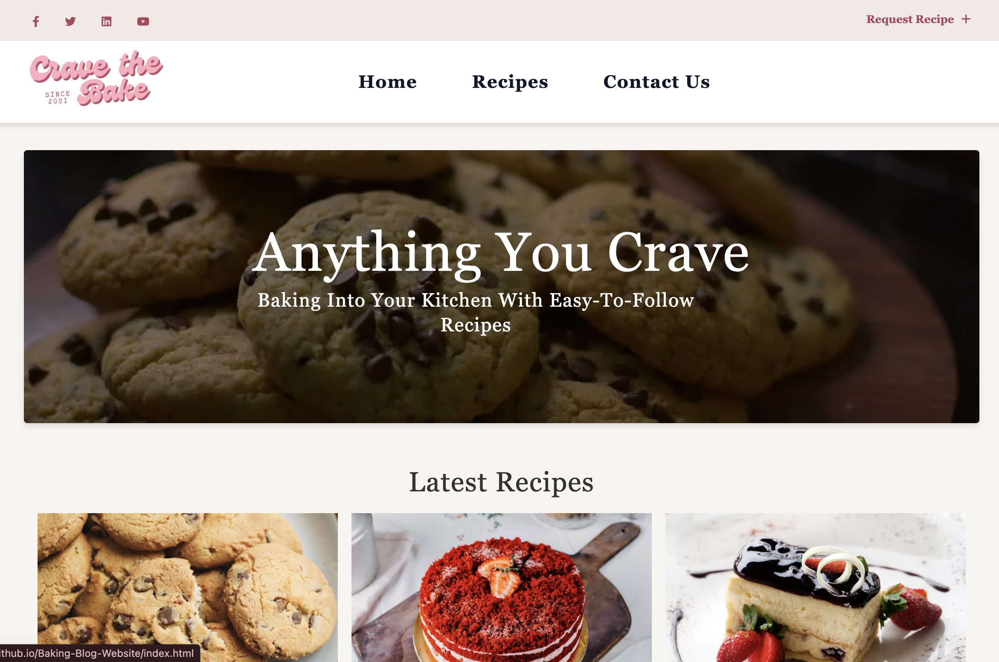

# Baking Blog Website 🍰

Welcome to my **Baking Blog Website**! This project is part of my **Introduction to Digital Services Course**, where I created a **3-page mobile-first, responsive website** all about baking.

##  Project Overview

This website is designed to share baking recipes, tips, and techniques for both **beginner** and **advanced bakers**. It features three pages that offer an inviting, easy-to-use experience, optimized for mobile devices.

###  Purpose
- To practice creating a responsive, mobile-first website.
- To share a variety of baking recipes, tips, and techniques with a wide audience.

###  Target Audience
- **Home bakers** looking for new recipes to try.
- **Baking enthusiasts** who want to explore new techniques.
- **Beginner bakers** seeking easy-to-follow recipes.

---

##  Technologies Used

- **HTML**: Structure and content of the website.
- **CSS**: Styling and mobile-first responsive design.
- **JavaScript**: Adding interactive features like lazy loading for videos.
- **GitHub Pages**: Hosting the website live online.

---

##  Pages in the Project

1. **Home Page** – A welcoming page that features a collection of baking recipes and tips.
2. **Recipe Page** – A dedicated page where users can explore detailed recipes and baking techniques.
3. **About Page** – A brief section about the website and its goals.

---

##  How to View the Website

You can view the live version of the website here:  
[**Live Demo**](https://maab-osman.github.io/Baking-Blog-Website/index.html)



---

## 🛠️ Running the Project Locally

To run this project on your local machine:
1. Clone the repository:
    ```bash
    git clone https://github.com/maab-osman/Baking-Blog-Website.git
    ```
2. Navigate into the project folder:
    ```bash
    cd Baking-Blog-Website
    ```
3. Open `index.html` in your browser to view the website.

---

##  Features

- **Mobile-first design**: Optimized to look great on mobile devices first, then adapts to larger screens.
- **Responsive layout**: The design adjusts to different screen sizes for easy viewing on any device.
- **Baking recipes**: Step-by-step guides for various baking projects like cakes, cookies, and more.
- **Easy navigation**: Clear, simple layout with easy access to all pages.

---

##  Contributing

If you'd like to contribute or suggest changes:
1. Fork the repository.
2. Create a new branch.
3. Make your changes and submit a pull request!

---

##  License

This project is licensed under the MIT License.

---

##  Key Learning Outcomes

- Created a mobile-first responsive website.
- Gained hands-on experience with HTML, CSS, and JavaScript.
- Learned how to structure and develop a simple web project.

---

Enjoy exploring new baking recipes and tips! 🍪

If you'd like to contribute or modify the website locally:
1. Clone the repository:  
   ```bash
   git clone https://github.com/maab-osman/Baking-Blog-Website.git
